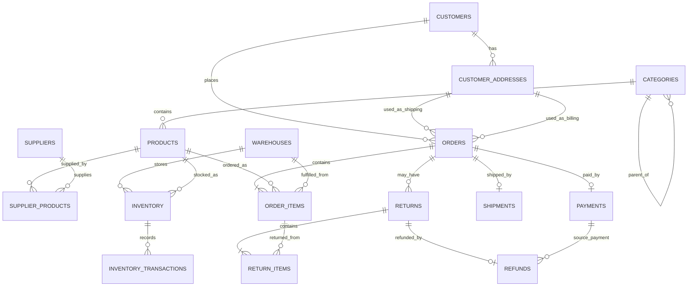

# E-Commerce Order & Inventory Management Database

Portfolio-quality MySQL 8.0+ database project focused on relational design, transaction processing, data integrity, inventory movement, order processing, payments, shipping, returns, refunds, and query optimization.

This is not a dashboard project. The goal is to show that a fresher can design and explain a realistic operational database used by an e-commerce backend.

## Project Overview

`ecommerce_order_inventory_db` models the core database of an e-commerce company. It stores customers, addresses, categories, products, suppliers, warehouses, inventory, orders, payments, shipments, returns, and refunds.

The strongest part of the project is the transaction logic:

- `place_order()` validates customer, address, products, and stock before creating an order.
- Inventory is deducted only inside the same transaction as the order.
- Failed orders roll back cleanly.
- Returns validate the original order item and quantity before restocking inventory.
- Refunds are tied to valid returns and payments.

## Key Features

- Normalized relational schema with primary keys, foreign keys, unique constraints, checks, defaults, and timestamps.
- Deterministic synthetic data: 120 customers, 60 products, 12 suppliers, 4 warehouses, 550 orders, 1,000+ order items, payments, shipments, inventory movements, returns, and refunds.
- Transaction-safe stored procedures for order placement, inventory additions, returns, refunds, and order status changes.
- Integrity triggers for negative inventory and invalid return items.
- Practical views for application/reporting use cases.
- Advanced SQL query collection covering joins, aggregation, CASE, subqueries, CTEs, recursive CTEs, and window functions.
- Indexes based on real query patterns plus an EXPLAIN demonstration.
- Executable data-integrity tests.

## Architecture

The database is organized into these modules:

| Module | Tables |
|---|---|
| Customer Management | `customers`, `customer_addresses` |
| Product Management | `categories`, `products` |
| Supplier Management | `suppliers`, `supplier_products` |
| Inventory Management | `warehouses`, `inventory`, `inventory_transactions` |
| Order Management | `orders`, `order_items` |
| Payment Management | `payments` |
| Shipping | `shipments` |
| Returns and Refunds | `returns`, `return_items`, `refunds` |

## ER Diagram



## Database Schema

| Table | Purpose |
|---|---|
| `customers` | Customer identity, contact, and account status. |
| `customer_addresses` | Billing/shipping addresses owned by customers. |
| `categories` | Product category hierarchy with self-reference. |
| `products` | Sellable catalog items with SKU, category, price, and status. |
| `suppliers` | Supplier master data. |
| `supplier_products` | Many-to-many supplier-product relationship with lead time and purchase cost. |
| `warehouses` | Fulfilment and storage locations. |
| `inventory` | Current product stock per warehouse. |
| `inventory_transactions` | Immutable stock movement history for purchases, sales, returns, and adjustments. |
| `orders` | Order header with customer, addresses, status, and total. |
| `order_items` | Line-level products, quantity, price snapshot, discount, and fulfilment warehouse. |
| `payments` | Payment method, status, amount, and transaction reference per order. |
| `shipments` | Shipment carrier, tracking, and delivery status per order. |
| `returns` | Return request/approval/refund status per order. |
| `return_items` | Returned quantities linked to original order items. |
| `refunds` | Refund status and amount linked to a valid return and payment. |

## Business Rules

- An order must contain at least one item.
- Customer email and product SKU must be unique.
- Orders can use only addresses owned by the same customer.
- Product prices, payment amounts, refund amounts, and order totals cannot be negative.
- Inventory cannot become negative.
- Each order item is fulfilled from a specific warehouse.
- A stock sale creates an inventory transaction with a negative quantity delta.
- A stock return creates an inventory transaction with a positive quantity delta.
- A return item must belong to the same order as the return request.
- Return quantity cannot exceed purchased quantity minus already accepted returns.
- Refunds must reference valid returns and valid payments.
- Only paid orders should move to shipped or delivered status.

## SQL Concepts Demonstrated

- Relational design and normalization to practical 3NF.
- Primary keys, foreign keys, unique constraints, check constraints, defaults.
- CRUD operations.
- INNER JOIN, LEFT JOIN, multi-table joins.
- GROUP BY, HAVING, SUM, AVG, COUNT, MIN/MAX.
- CASE statements.
- Correlated and non-correlated subqueries.
- CTEs and recursive CTEs.
- Window functions: `ROW_NUMBER()`, `RANK()`, `DENSE_RANK()`, `LAG()`, `LEAD()`, running totals.
- Views.
- Stored procedures.
- Functions.
- Triggers.
- Transactions with `START TRANSACTION`, `COMMIT`, and `ROLLBACK`.
- Indexing and query optimization with `EXPLAIN`.

## Installation

Requirements:

- MySQL Server 8.0+
- MySQL client or MySQL Workbench

Command-line execution from the project root:

```bash
mysql -u root -p < sql/01_create_database.sql
mysql -u root -p ecommerce_order_inventory_db < sql/02_create_tables.sql
mysql -u root -p ecommerce_order_inventory_db < sql/03_constraints.sql
mysql -u root -p ecommerce_order_inventory_db < sql/04_seed_data.sql
mysql -u root -p ecommerce_order_inventory_db < sql/05_views.sql
mysql -u root -p ecommerce_order_inventory_db < sql/06_functions.sql
mysql -u root -p ecommerce_order_inventory_db < sql/07_procedures.sql
mysql -u root -p ecommerce_order_inventory_db < sql/08_triggers.sql
mysql -u root -p ecommerce_order_inventory_db < sql/09_advanced_queries.sql
mysql -u root -p ecommerce_order_inventory_db < sql/10_indexes.sql
mysql -u root -p ecommerce_order_inventory_db < sql/11_tests.sql
```

In MySQL Workbench, open and run the files in the same order.

## Execution Order

1. `sql/01_create_database.sql`
2. `sql/02_create_tables.sql`
3. `sql/03_constraints.sql`
4. `sql/04_seed_data.sql`
5. `sql/05_views.sql`
6. `sql/06_functions.sql`
7. `sql/07_procedures.sql`
8. `sql/08_triggers.sql`
9. `sql/09_advanced_queries.sql`
10. `sql/10_indexes.sql`
11. `sql/11_tests.sql`

## Example Queries

```sql
SELECT * FROM vw_order_summary ORDER BY order_date DESC LIMIT 10;
```

Shows recent orders with customer, payment, shipment, and item-count details.

```sql
SELECT * FROM vw_product_inventory_status WHERE inventory_status = 'LOW_STOCK';
```

Finds products whose combined warehouse inventory is at or below reorder level.

```sql
CALL place_order(
    1,
    1,
    1,
    1,
    JSON_ARRAY(JSON_OBJECT('product_id', 1, 'quantity', 2)),
    'UPI',
    @order_id,
    @message
);
SELECT @order_id, @message;
```

Creates a transaction-safe order and deducts inventory.

## Testing

Run:

```bash
mysql -u root -p ecommerce_order_inventory_db < sql/11_tests.sql
```

The test script returns a result table. Expected invalid operations should show `PASS` because the database rejected them.

## Future Improvements

- Add cart and checkout idempotency keys to prevent duplicate client submissions.
- Add multi-payment support for split payments and wallet credits.
- Add purchase orders and supplier receipts as first-class workflows.
- Partition large order and inventory transaction tables by date.
- Add audit tables for high-risk status changes.
- Add optimistic locking or explicit reservation rows for high-concurrency inventory allocation.

## Interview Focus

Be ready to explain:

- Why order creation must be transactional.
- How foreign keys protect invalid customer/order/product relationships.
- Why inventory is stored by `(warehouse_id, product_id)`.
- How `place_order()` prevents negative stock.
- Why returns validate against original order items.
- How indexes were chosen from query patterns.
- What `EXPLAIN` tells you about query access paths.
