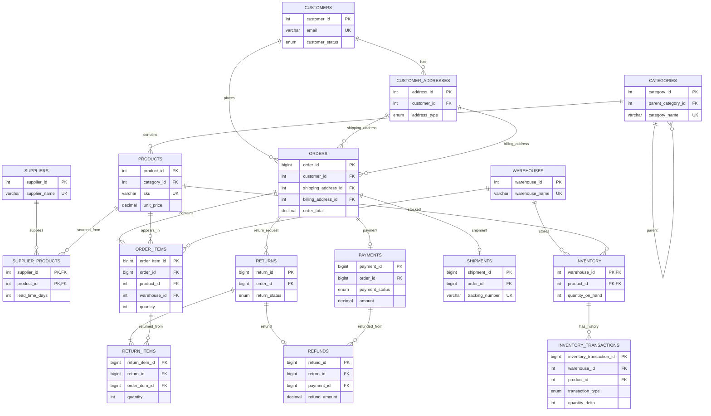

# ER Diagram

```mermaid
erDiagram
    CUSTOMERS {
        int customer_id PK
        varchar email UK
        enum customer_status
    }
    CUSTOMER_ADDRESSES {
        int address_id PK
        int customer_id FK
        enum address_type
    }
    CATEGORIES {
        int category_id PK
        int parent_category_id FK
        varchar category_name UK
    }
    PRODUCTS {
        int product_id PK
        int category_id FK
        varchar sku UK
        decimal unit_price
    }
    SUPPLIERS {
        int supplier_id PK
        varchar supplier_name UK
    }
    SUPPLIER_PRODUCTS {
        int supplier_id PK,FK
        int product_id PK,FK
        int lead_time_days
    }
    WAREHOUSES {
        int warehouse_id PK
        varchar warehouse_name UK
    }
    INVENTORY {
        int warehouse_id PK,FK
        int product_id PK,FK
        int quantity_on_hand
    }
    INVENTORY_TRANSACTIONS {
        bigint inventory_transaction_id PK
        int warehouse_id FK
        int product_id FK
        enum transaction_type
        int quantity_delta
    }
    ORDERS {
        bigint order_id PK
        int customer_id FK
        int shipping_address_id FK
        int billing_address_id FK
        decimal order_total
    }
    ORDER_ITEMS {
        bigint order_item_id PK
        bigint order_id FK
        int product_id FK
        int warehouse_id FK
        int quantity
    }
    PAYMENTS {
        bigint payment_id PK
        bigint order_id FK
        enum payment_status
        decimal amount
    }
    SHIPMENTS {
        bigint shipment_id PK
        bigint order_id FK
        varchar tracking_number UK
    }
    RETURNS {
        bigint return_id PK
        bigint order_id FK
        enum return_status
    }
    RETURN_ITEMS {
        bigint return_item_id PK
        bigint return_id FK
        bigint order_item_id FK
        int quantity
    }
    REFUNDS {
        bigint refund_id PK
        bigint return_id FK
        bigint payment_id FK
        decimal refund_amount
    }

    CUSTOMERS ||--o{ CUSTOMER_ADDRESSES : has
    CUSTOMERS ||--o{ ORDERS : places
    CUSTOMER_ADDRESSES ||--o{ ORDERS : shipping_address
    CUSTOMER_ADDRESSES ||--o{ ORDERS : billing_address
    CATEGORIES ||--o{ CATEGORIES : parent
    CATEGORIES ||--o{ PRODUCTS : contains
    SUPPLIERS ||--o{ SUPPLIER_PRODUCTS : supplies
    PRODUCTS ||--o{ SUPPLIER_PRODUCTS : sourced_from
    WAREHOUSES ||--o{ INVENTORY : stores
    PRODUCTS ||--o{ INVENTORY : stocked
    INVENTORY ||--o{ INVENTORY_TRANSACTIONS : has_history
    ORDERS ||--|{ ORDER_ITEMS : contains
    PRODUCTS ||--o{ ORDER_ITEMS : appears_in
    WAREHOUSES ||--o{ ORDER_ITEMS : fulfils
    ORDERS ||--o| PAYMENTS : payment
    ORDERS ||--o| SHIPMENTS : shipment
    ORDERS ||--o{ RETURNS : return_request
    RETURNS ||--|{ RETURN_ITEMS : includes
    ORDER_ITEMS ||--o{ RETURN_ITEMS : returned_from
    RETURNS ||--o| REFUNDS : refund
    PAYMENTS ||--o{ REFUNDS : refunded_from
```
